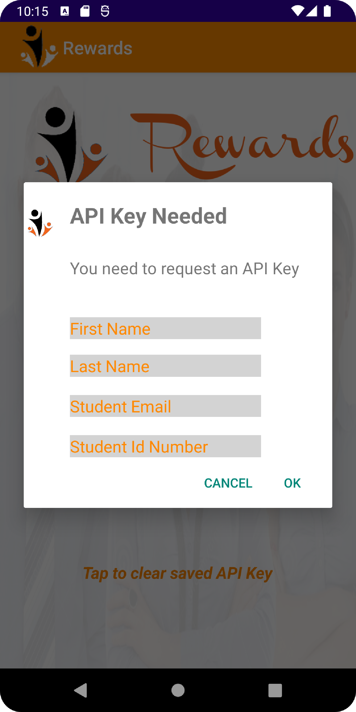
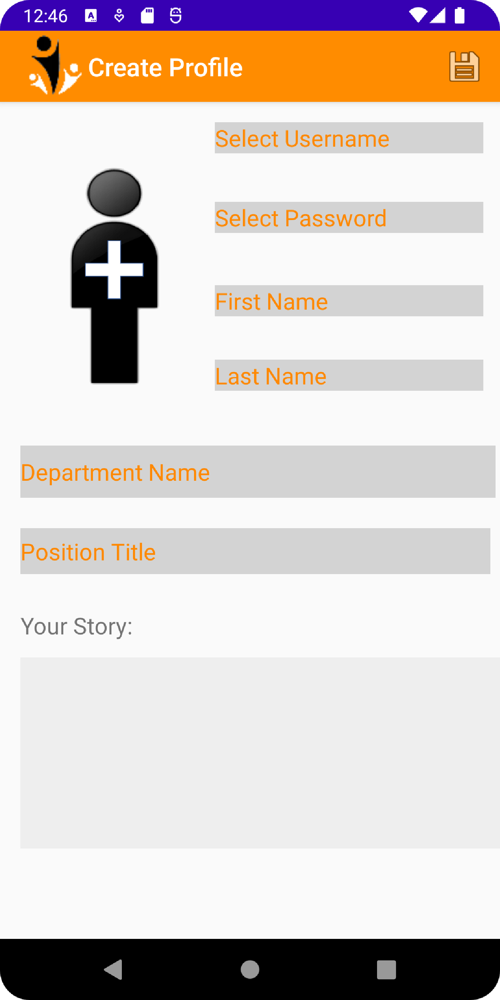
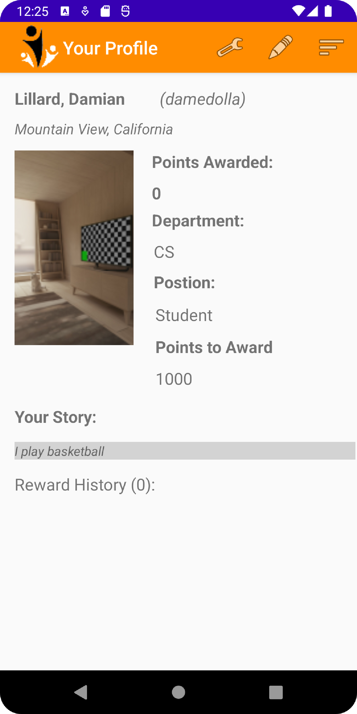
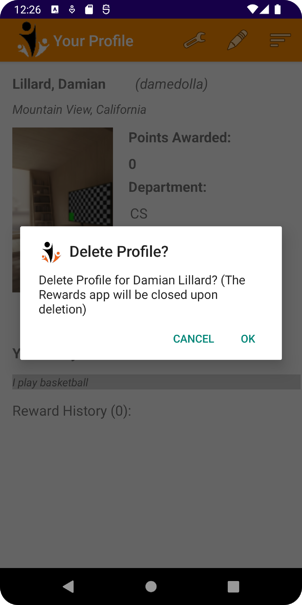
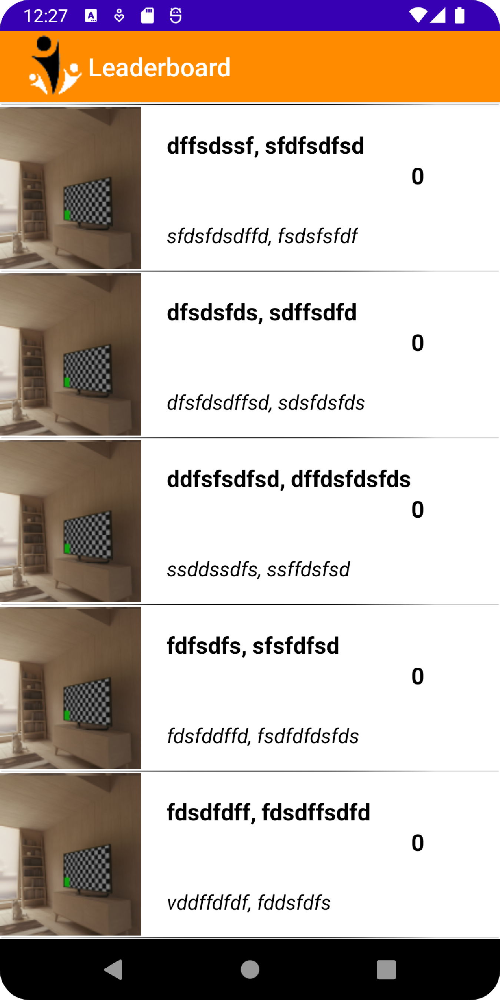
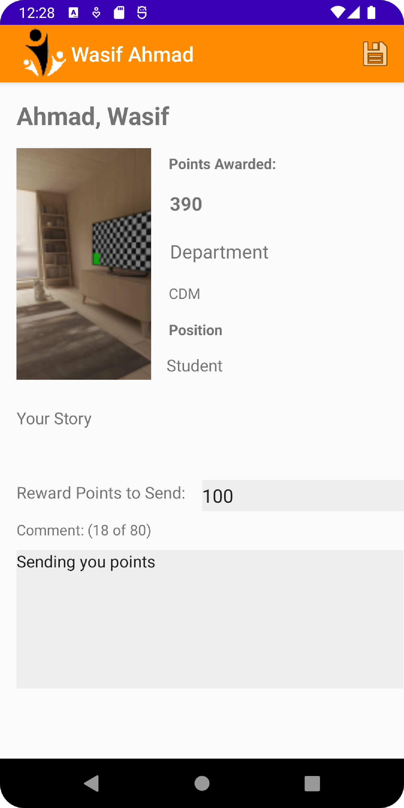

# AndroidRewardsApp

This android application serves as a rewards points transfer application for a company where registered users can transfer rewards points to each other. It operates
as a REST API where users can create a profile for themselves, edit/delete their profile, and get a listing of all of the other registered users so that points can be transferred
to the chosen recipient. 

### Creating a profile 

When the app is started it first checks to see if an API key has been created and stored. If a key is destected it will not prompt the user to create a new key and the user 
can either log into an existing profile or register a new profile. If no key has been detected then the user is prompted to enter information that is sent to a server and 
an API key is returned back to the user. This key will be used to interact with the server to perform all of the REST commands. 

   

### Viewing a Profile

Upon a successful login the user if directed to a page showing their general profile information, their available points to award, and a historical record of awarded point.
There is a menu bar on the top where the user can further edit their profile information, delete their account, or go to the page where they can award other users points.

   

### Awarding Points

The user is able to access a list of all of the registered users and can click on a user to aware points. Once points are awarded the user is returned back to the list 
with the updated points leaderboard. 

   

### Features and Techniques 

Multi-Activity, Location Services, Geocoding, Internet, APIs, Images, Camera, Gallery
